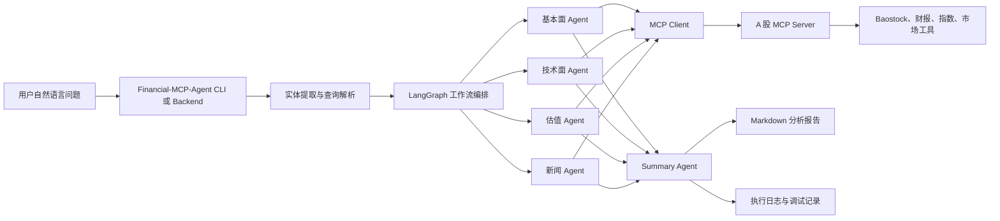
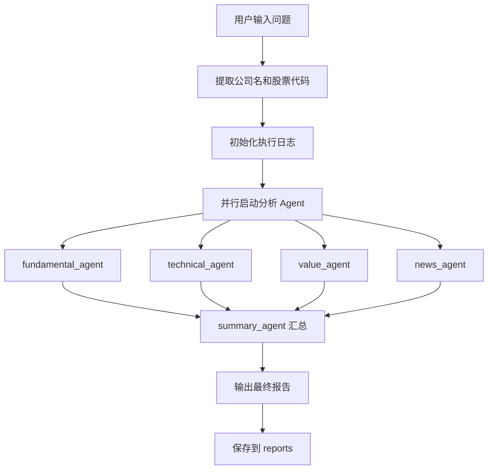
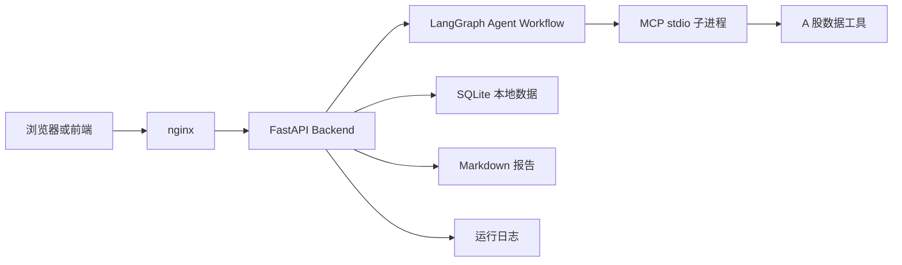

# 金融分析 MCP 智能体系统

<div align="center">

面向 A 股研究与金融问答的多智能体实验仓库  
集成 `LangGraph` 工作流、`MCP` 数据服务、本地/远程大模型调用，以及新闻情感与风险建模脚本

</div>

---

## 1. 项目简介

本仓库是一个围绕金融分析场景构建的 AI Agent 实验项目，核心目标是把自然语言输入转成结构化的股票研究流程，并最终输出可读的分析报告。

当前最完整、最适合直接运行的部分是：

- `Finance/Financial-MCP-Agent`
  一个面向用户的多智能体金融分析主程序
- `Finance/a-share-mcp-is-just-i-need`
  一个为主程序提供 A 股数据能力的 MCP Server

除此之外，仓库还包含若干训练脚本、数据清洗脚本、模型下载脚本和本地 vLLM 启动脚本，用于支撑新闻情感分类、风险打分以及本地模型部署。

## 2. 项目亮点

- 自然语言驱动：支持直接输入“分析比亚迪”“603871 值得买吗”等问题
- 多智能体协作：基本面、技术面、估值、新闻分析并行执行
- MCP 集成：通过标准 MCP 协议接入 A 股数据服务
- 报告生成：自动输出 Markdown 格式分析报告
- 本地模型支持：可接入本地 vLLM，也可接远程 OpenAI Compatible API
- 双检索增强：同时支持 `C8 Hybrid RAG` 与 `C9 Graph RAG`
- 研究扩展能力：仓库保留了情感分析、风险建模和数据处理实验链路

## 3. 系统架构



## 4. 核心工作流



## 5. 仓库结构

```text
agent_demo/
├── README.md
├── download_datasets.sh
├── download_qwen3_5_9b.sh
├── download_qwen_text_models.sh
├── start_qwen_vllm.sh
├── stop_qwen_vllm.sh
├── test_qwen_local_127.sh
├── test_qwen_vllm.sh
└── Finance/
    ├── requirements.txt
    ├── Financial-MCP-Agent/
    │   ├── .env.example
    │   ├── deploy/
    │   ├── frontend/
    │   ├── scripts/
    │   ├── src/
    │   ├── test/
    │   ├── logs/
    │   └── reports/
    ├── a-share-mcp-is-just-i-need/
    │   ├── docs/
    │   ├── src/
    │   └── mcp_server.py
    ├── data_process.py
    ├── download.py
    ├── train_qwen_sentiment.py
    ├── train_qwen_sentiment_qlora.py
    ├── train_qwen_risk.py
    └── train_qwen_risk_qlora.py
```

## 6. 关键模块说明

### `Financial-MCP-Agent`

主入口位于 `Finance/Financial-MCP-Agent/src/main.py`，负责：

- 读取环境变量
- 接收命令行或交互式输入
- 提取公司名称与股票代码
- 调度 LangGraph 工作流
- 调用多个分析 Agent
- 汇总结果并生成报告

当前主流程可以概括为：

```text
start
  -> fundamental_agent
  -> technical_agent
  -> value_agent
  -> news_agent
  -> summary_agent
  -> END
```

### `a-share-mcp-is-just-i-need`

这是配套的 A 股 MCP 数据服务，主程序通过 `stdio` 方式拉起该服务并调用工具。它主要提供：

- K 线与行情数据
- 财务报表数据
- 指数与市场概览
- 宏观工具
- 日期和交易日辅助能力
- 新闻抓取与分析辅助能力

### `Finance/` 研究脚本

这部分更多是实验与训练资产，典型内容包括：

- 新闻情感模型训练
- 新闻风险模型训练
- 金融文本清洗与去重
- Qwen 模型下载
- Notebook 分析实验

这部分不是主分析系统运行的强依赖，但构成了项目的研究背景与扩展能力。

## 7. 技术栈

- Python 3.11+
- LangGraph
- LangChain
- FAISS
- Neo4j
- MCP / FastMCP
- Baostock
- Transformers
- PEFT / LoRA
- Hugging Face Hub
- OpenAI Compatible API
- vLLM

当前根依赖文件位于 `Finance/requirements.txt`：

```text
langgraph==0.6.6
python-dotenv==1.1.1
langchain-openai==0.3.30
langchain-core==0.3.74
baostock==0.8.9
peft==0.17.0
langchain-mcp-adapters==0.1.9
transformers==4.51.3
huggingface-hub==0.34.4
uv==0.8.12
```

## 7.1 RAG 存储设计

项目当前有两条检索增强链路：

- `C8 Hybrid RAG`
  使用 [vector_service.py](/home/irving/workspace/agent_demo/Finance/Financial-MCP-Agent/src/services/vector_service.py) 提供向量检索
- `C9 Graph RAG`
  使用 [graph_store.py](/home/irving/workspace/agent_demo/Finance/Financial-MCP-Agent/src/persistence/graph_store.py) 提供图关系检索

当前实现说明：

- 向量索引已经升级为 `FAISS` 本地持久化索引
- 文档元数据单独保存在 JSON 清单中，JSON 不再作为向量索引本体
- 默认落盘形式为 `data/vector_store_faiss/` + `data/vector_store_docs.json`
- 图存储默认使用本地 JSON 三元组
- 当配置 `NEO4J_URI`、`NEO4J_USERNAME`、`NEO4J_PASSWORD` 后，`GraphStore` 会切换到 Neo4j

可以把它理解为：

```text
报告文本 / 知识文档
  -> chunk
  -> embedding
  -> FAISS 向量索引（C8）

报告文本
  -> 三元组抽取
  -> GraphStore / Neo4j（C9）
```

## 8. 快速开始

### 8.1 准备环境

```bash
cd /home/irving/workspace/agent_demo
python -m venv .venv
source .venv/bin/activate
pip install -r Finance/requirements.txt
```

如果你习惯使用 Conda，也可以使用自己的环境管理方式。仓库里的部分脚本默认假设存在 `lamost` 和 `sft` 环境，如果实际环境名不同，需要自行调整脚本。

### 8.2 配置环境变量

先复制模板：

```bash
cp Finance/Financial-MCP-Agent/.env.example Finance/Financial-MCP-Agent/.env
```

`.env.example` 当前包含 OpenAI Compatible API 配置：

```env
OPENAI_COMPATIBLE_API_KEY=your_openai_compatible_api_key
OPENAI_COMPATIBLE_BASE_URL=your_base_url
OPENAI_COMPATIBLE_MODEL=your_model_name
USE_LOCAL_MODEL=api
```

建议根据你的模型接入方式填写以下信息：

- `OPENAI_COMPATIBLE_API_KEY`
- `OPENAI_COMPATIBLE_BASE_URL`
- `OPENAI_COMPATIBLE_MODEL`
- 如有 Gemini 相关代码路径，也建议补齐对应变量

### 8.3 检查 MCP Server 路径

`Finance/Financial-MCP-Agent/src/tools/mcp_config.py` 当前默认路径为：

```python
_DEFAULT_MCP_DIR = r"/home/irving/workspace/agent_demo/Finance/a-share-mcp-is-just-i-need"
```

该配置已经支持用环境变量 `MCP_SERVER_DIR` 覆盖。如果你换了部署目录，优先改环境变量，不建议手改源码。

## 9. 启动方式

### 方案 A：直接运行主程序

适合先验证核心分析链路。

```bash
cd /home/irving/workspace/agent_demo/Finance/Financial-MCP-Agent
python src/main.py
```

也可以直接使用命令行参数：

```bash
python src/main.py --command "分析比亚迪"
python src/main.py --command "603871 这个股票值得买吗"
```

### 方案 B：使用本地 vLLM 提供 OpenAI Compatible API

如果你希望在本地部署 Qwen 模型，可使用仓库根目录脚本。

1. 启动 vLLM

```bash
bash start_qwen_vllm.sh
```

2. 检查服务状态

```bash
bash test_qwen_local_127.sh
bash test_qwen_vllm.sh
```

3. 停止服务

```bash
bash stop_qwen_vllm.sh
```

`start_qwen_vllm.sh` 默认行为：

- 模型目录：`/home/irving/workspace/agent_demo/Qwen3.5-Tiny`
- 监听地址：`0.0.0.0:8000`
- 输出日志：`logs/vllm/`
- 输出 PID 文件：`logs/vllm/qwen_vllm.pid`

如果 `Current Env` 测试失败但 `Bypass Proxy` 成功，通常说明代理环境拦截了本地请求。

### 方案 C：Docker 部署

`Finance/Financial-MCP-Agent/deploy/` 下已经准备了 Docker 部署方案。

容器镜像会在构建阶段自动安装向量检索和图检索所需依赖，包括：

- `faiss-cpu`
- `langchain-huggingface`
- `sentence-transformers`
- `langchain-community`
- `neo4j`

因此 Docker 方式下不需要额外手工安装这些库。

首次构建启动：

```bash
bash Finance/Financial-MCP-Agent/deploy/start.sh --build
```

日常启动：

```bash
bash Finance/Financial-MCP-Agent/deploy/start.sh
```

停止服务：

```bash
bash Finance/Financial-MCP-Agent/deploy/start.sh --down
```

查看日志：

```bash
docker compose -f Finance/Financial-MCP-Agent/deploy/docker-compose.yml logs -f backend
```

## 10. 启动脚本一览

| 脚本 | 作用 | 说明 |
|------|------|------|
| `start_qwen_vllm.sh` | 启动本地 vLLM 服务 | 自动写 PID、轮询 `/health`、输出日志 |
| `stop_qwen_vllm.sh` | 停止 vLLM 服务 | 优先读 PID 文件，失败后回退到 `pgrep` |
| `test_qwen_local_127.sh` | 本地接口快速自检 | 检查 `/health`、`/v1/models`、chat |
| `test_qwen_vllm.sh` | 完整联通性检查 | 增加代理变量、端口和进程诊断 |
| `download_qwen_text_models.sh` | 下载 Qwen 文本模型 | 默认下载到 `models/` |
| `download_qwen3_5_9b.sh` | 下载 Qwen3.5-9B 模型 | 支持自定义模型 ID 和目标路径 |
| `download_datasets.sh` | 下载实验数据集 | 下载 `risk_nasdaq` 和 `nasdaq_news_sentiment` |

## 11. 输入示例

你可以直接输入：

- `分析嘉友国际`
- `帮我看看比亚迪这只股票怎么样`
- `603871 这个股票值得买吗`
- `请帮我分析一下茅台(600519)的投资价值`
- `给我分析一下宁德时代的财务状况`

## 12. 输出结果

系统运行后主要产出两类内容：

- `Finance/Financial-MCP-Agent/reports/`
  最终生成的 Markdown 报告
- `Finance/Financial-MCP-Agent/logs/`
  执行日志、模型调用轨迹、错误记录

典型交付形式包括：

- 个股分析报告
- 错误报告
- Agent 调试日志
- RAG / 工具链评估日志

## 13. 部署视图



## 14. 适用场景

- A 股个股初筛与研究辅助
- 自然语言驱动的金融问答
- 多智能体工作流实验
- MCP 接入模式验证
- 本地大模型金融分析实验
- 金融新闻情感与风险建模

## 15. 当前注意事项

- 当前仓库偏实验型，仍有部分路径和环境名是本地化配置
- 某些脚本依赖 Conda 环境名，如 `lamost`、`sft`
- 本地 vLLM 路径与模型目录是写死在脚本中的，迁移环境时需要调整
- 大模型、数据集、日志和数据库文件体积较大，默认不建议纳入 Git
- 如果要在新机器复现，优先确认 `.env`、`MCP_SERVER_DIR`、模型目录和 Python 环境

## 16. 推荐上手顺序

1. 安装 `Finance/requirements.txt`
2. 复制并补全 `Finance/Financial-MCP-Agent/.env`
3. 确认 `MCP_SERVER_DIR` 指向 `Finance/a-share-mcp-is-just-i-need`
4. 先运行 `python src/main.py --command "分析比亚迪"`
5. 如需本地模型，再使用 `start_qwen_vllm.sh`
6. 最后再考虑 Docker 化部署

## 17. 后续可继续完善的方向

- 增加统一的根级 `Makefile` 或 `justfile`
- 为主程序补充标准化安装方式
- 输出更稳定的前端演示页面或截图
- 把实验脚本与产品主链路进一步解耦
- 补充 CI、测试覆盖率和基准评估报告

---

## 18. License / Usage

当前仓库更适合作为内部研究、Demo 和工程验证用途。  
若要对外发布，建议进一步整理：

- 开源许可证
- 数据来源说明
- 模型使用限制
- 商业使用边界
- 风险免责声明
